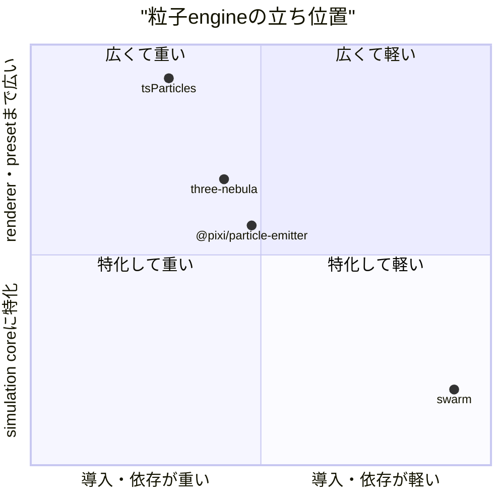

# swarm 市場調査

## 0. 要約

立ち位置: rendererを持たず、依存ゼロ・固定dt・seed付きで大量粒子を動かす小さなengineで、一般的なWeb粒子ライブラリとは勝負する層が少し違う。

最大の弱点: 現在の公開実装はM1までで、README/DESIGNが示すSPH-lite水流とcollisionは未実装のTODOであり、実用エフェクトの幅はまだ狭い。

次の一手: まず決定論性とheadless性を壊さず、M2を実装して「描画器に依存しない粒子＋軽量流体」という選択理由を実測ベンチとサンプルで固める。

## 1. このrepoは何か

swarmは、`Field`に重力・drag・sinベースのwind・flutter・vortexを設定し、seed付き`emit`と固定dtの`step`で粒子を更新する、純粋なESMの粒子シミュレーションengineである。hostは`field.positions`、`field.velocities`、`field.count`などのflat bufferを読み、描画方法を自分で決める。three.js、canvas、DOMをimportせず、runtime依存もない。

READMEだけでなく`index.js`、`DESIGN.md`、`test.mjs`を確認した。実装上は2Dのpos/velに加え、深度z、粒子ごとのphase/spin/wobble、angle/depths accessorまであり、単なるREADMEの最小例より広い。一方、M2のuniform-grid/SPH-liteとM3のbounds collisionはコード中のTODOで、現時点では未提供である。

価値を出す単位はswarm単体の完成品ではなく、ゲームや可視化hostが「シミュレーションを行う → flat bufferを任意rendererで描く」という組み合わせである。したがって比較対象は、同じ粒子更新APIを提供するengineであり、完成した描画作品やrenderer単体ではない。想定利用者は、ゲーム・演出・可視化を実装するJavaScript開発者で、再現可能なreplay/testとhost非依存性を重視する人である。

確認できた客観指標は、`index.js` 204行・10,954 bytes、公開export 2（`Field`、`mulberry32`）、runtime依存0、`test.mjs` 180行・24個の`ok`呼び出し、実行結果26 passed、MITライセンス、npm package version 0.1.0である。

## 1.5 調査の型

`target_type: engine`。出力は煙・雪・花びら・水しぶきなどの演出に使うが、利用者が選ぶのは「作品」ではなく、入力データ、状態、拡張点、時間step、出力bufferを持つライブラリAPIである。よってAPIの宣言性、決定論性、rendererとの分離、粒子更新の重さを主軸に比較し、見た目の面白さは比較しない。

## 2. 比較対象と選定理由

| 製品 | 何ができるか | 採用状況 | ライセンス | うちとの決定的な違い | なぜ選んだか |
|---|---|---|---|---|---|
| three-nebula | three.js向け3D粒子。Emitter、initializer、behaviour、sprite/mesh renderer、JSON構成、GUI/editor連携 | GitHub 約1.2k stars / npm 11.1.2、2026-07-31確認。npmでは直近publishが数日前 | MIT | three.jsをpeer dependencyとして描画統合まで担う。swarmはplain bufferを返す | renderer統合型の3D粒子engineとして、API設計と依存の重さを比較できる代表例 |
| @pixi/particle-emitter | PixiJS Containerに対するemitter、lifetime/frequency/behaviour設定、interactive editor | GitHub 853 stars / package 5.0.10、2026-07-31確認。GitHubページの最終更新日そのものは取得できず、npmの旧package `pixi-particles` は最終publish 5年前 | MIT | rendererとPixiJSのscene graphを前提に、宣言的設定で見た目を組む。swarmはhost非依存 | 2D WebGL系の実用的なemitter APIとして、swarmの最小`Field.emit/step`との違いが明瞭 |
| tsParticles | ブラウザ向け2D粒子、confetti/fireworks、shape/updater/interaction/plugin、React/Vue等のwrapper、presetとeditor/demo | GitHub 約8.9k stars / npm `tsparticles` 4.3.2、2026-07-31確認。npmの直近publishは18日前 | MIT | 大規模なWeb製品群・plugin ecosystemで、描画・framework・presetまで含む。swarmはsimulation coreに絞る | 最大の採用規模を持つ汎用Web粒子engineで、機能の広さと導入の重さの上限を確認するため |

この地図は「汎用の見た目生成」と「小さな物理寄りのcore」の分業であり、三者は市場の主流であるrenderer・preset・framework統合側に寄っている。swarmはstar数で競う位置ではなく、描画を持たないことを利点にできる狭い領域にいる。特にtsParticlesはpluginやwrapperを大量に持つため、機能数を追うだけでは差別化が消える。

## 3. ポジショニング



軸は、実際にAPI選択を左右する依存・host結合の軽さと、renderer/presetを含む提供範囲である。位置は機能と依存構造からの定性的整理で、座標自体は測定値ではないため、図は採用状況の棒グラフとして解釈しない。

## 4. 機能比較

| 機能 | 重み | swarm | three-nebula | @pixi/particle-emitter | tsParticles |
|---|---|---|---|---|---|
| 重力・drag・時間step | ◎必須 | ○ | ○ | ○ | ○ |
| seeded PRNGと同一入力の再現 | ◎必須 | ○ | △（コード/API上でseeded replayを主機能として確認できず） | △（コード/API上でseeded replayを主機能として確認できず） | △（主用途はブラウザ演出で、seeded replayは主機能として確認できず） |
| renderer非依存のflat buffer | ◎必須 | ○ | × | × | × |
| headless Nodeでの実行・テスト | ◎必須 | ○ | △（rendererなしのcore利用は要検証） | ×（PixiJS Container前提） | △（engine packageは分離されるが主導線はbrowser） |
| emitterの宣言的設定・rate制御 | ○効く | △（`emit(n, options)`中心） | ○ | ○ | ○ |
| 3D sprite/mesh renderer | △あれば | × | ○ | × | × |
| plugin・behaviour・shape拡張 | ○効く | △（Fieldの固定力とhost accessor） | ○ | ○ | ○ |
| collision / bounds | ○効く | ×（M3 TODO） | ○（behaviour/zoneの構成で対応） | △（設定・behaviour依存） | ○（collision interaction） |
| SPH-lite / neighbour-based fluid | ◎必須 | ×（M2 TODO） | ×（一般粒子behaviourとして確認できず） | × | × |
| CDN/ブラウザ直利用 | △あれば | ○（single-file CDN例） | ○ | ○ | ○ |
| MIT | ◎必須 | ○ | ○ | ○ | ○ |

この表で痛い×はcollisionとSPH-liteである。前者はゲーム演出の「着地・積もり」を、後者は水しぶきというREADME上の主要ユースケースを止める。一方、renderer、shape、pluginの×は汎用粒子市場では弱みに見えるが、renderer非依存を守る限り全てを埋める必要はない。seeded replayとheadless性は競合の公式主用途からは強く確認できないため、ここを機能数の差ではなく選択理由として伝えるべきである。

## 4.5 コード・実装の比較

| 観点 | swarm | three-nebula | @pixi/particle-emitter | tsParticles | 出典 |
|---|---:|---:|---:|---:|---|
| 公開exportの確認値 | 2 | 多数（個別数は未集計） | 多数（個別数は未集計） | workspace内の複数package（個別数は未集計） | 自repo `index.js`、各repo README/package |
| runtime dependencies | 0 | 3（lodash, potpack, uuid）＋peer `three` | 0だがpeer `@pixi/*` 6 package | package単位で分割。workspace rootのruntime依存数はこの調査では未集計 | `package.json` |
| 配布サイズ上限 | 10,954 bytes（index.js、圧縮前） | 105 kB（build設定のbundle上限、圧縮なし） | この調査では未取得 | この調査では未取得 | 各repo `package.json`、自repo `wc -c` |
| テスト確認 | 26 passed / 24 `ok`呼び出し | test scriptはMocha + coverageを確認。実行は未実施 | package scriptは`test: echo done` | Vitest等の構成を確認。実行は未実施 | 各repo `package.json`、自repo `npm test` |
| 状態表現 | Float64Arrayのflat pos/vel/life/age等、swap-remove | object/Emitter/Particle/behaviour構成 | PixiJS display objectに結合 | plugin/updater/container構成 | コードとpackageの確認 |

実装前提が違うので、サイズやAPI数の単純な優劣は比較できない。three-nebulaとPixiJS emitterはrendererと豊富なbehaviourを買う設計、tsParticlesはecosystemを買う設計、swarmはflat state・依存ゼロ・テスト可能性を買う設計である。なお比較対象は公開コードとpackageを読んだが、ローカルで依存をinstallしてテストを実行するところまではネットワーク制限でできなかったため、競合のテスト結果を推測していない。

## 5. 採用状況

| 製品 | GitHub stars（2026-07-31参照） | 補助指標 |
|---|---:|---|
| swarm | 不明（GitHub表示をこの調査で取得できず） | npm 0.1.0、repo HEAD 2026-07-31時点 |
| three-nebula | 約1.2k | npm 11.1.2、直近publishは数日前 |
| @pixi/particle-emitter | 853 | package 5.0.10 |
| tsParticles | 約8.9k | npm 4.3.2、直近publishは18日前 |

star数は採用の絶対値ではないが、swarmが後発の小規模repoであることと、tsParticlesがecosystem競争では桁違いであることは示す。ここから正面衝突を選ぶのは合理的でなく、採用者が実際に困る再現性・host分離・軽量流体を短い導入例で証明する方がよい。

## 5.5 調査者の見立て

本当の勝負所は、機能の多さではなく「描画器を選ばず、同じseedと固定dtから同じflat stateを得られる」ことだと読める。M2 SPH-liteは、その核を単なる粒子emitterではなくする最も効率のよい拡張である。

数字に出ていない懸念は、現在のREADMEがM2〜M4を用途として掲げる一方、公開実装がM1で止まっていることだ。利用者はroadmapではなく、今インストールして使える境界を重視するため、未実装の水・collisionを前面に出すと信頼を損なう可能性がある（推測）。

自分なら、rendererやeditorを足す前に、M2と性能・再現性のfixtureを入れ、Nodeでの最小例とhost adapter例を増やす。汎用Web粒子の機能表で追いつくより、netmahgのreplayと接続できることを実証する。

この見立てが外れるとしたら、対象利用者がreplay/testではなく、すぐ使える見た目・editor・framework wrapperを最優先するときである。その場合はtsParticlesやthree-nebulaの方が合理的で、swarmの差別化は採用理由にならない。また競合が依存ゼロ・headless・seeded replayを同じ簡潔なAPIで実現した場合も、最大の優位は消える。

## 6. 提案（優先順）

| 順 | 提案 | 分類 | 根拠 | 最小の一手 | 効きそうな指標 |
|---:|---|---|---|---|---|
| 1 | M2 SPH-liteを実装し、uniform-grid・density・pressure・viscosityを固定dtで検証する | 埋める | 機能表の◎だが未実装。READMEの水/splash価値を実体化できる | 近傍gridと小規模fixtureを追加し、同seedのpositionsをbyte比較 | 500〜5,000粒子のstep時間、NaN数、同seed一致、M2テスト数 |
| 2 | collisionをplane/boxの最小APIとして実装し、M3 roadmapを完了する | 埋める | bounds collisionが○の競合に対して×。snow settle/splash landingに直結 | restitution/frictionを2Dだけで追加し、bounce/settle fixtureを作る | collision fixture pass率、1,000粒子step時間、導入例数 |
| 3 | `Field`の決定論性・headless性・buffer契約をベンチとhost adapterで明文化する | 伸ばす | swarm固有の◎で、競合の主用途からは同等性を確認できない | Nodeの再生fixture、Canvas/three/Pixiの薄いサンプルを別repoまたはdocsに置く | 最小例の行数、再生一致、renderer側コード量、依存数 |
| 4 | READMEで「実装済みM1」と「未実装M2/M3」を明確に分離する | 伸ばす | 現在のREADMEは未実装機能を用途として強く掲げるため、採用時の期待値差が出る（推測） | Status表と実行可能なM1サンプルを追加 | issueでの未実装誤解、M1導入完了時間 |
| 5 | renderer・editor・framework wrapperをcoreに内蔵することはやらない | やらない | tsParticles/three-nebulaとの機能数競争になり、renderer非依存と依存ゼロという差別化を薄める | adapterは別package/サンプルに留め、coreのexportと依存を増やさない | runtime依存0の維持、core配布サイズ、API変更数 |

## 7. 選択の分岐

```mermaid
flowchart TD
  A[粒子エンジンの要件] --> B{"描画器・preset・editorまで必要?"}
  B -->|はい| C{"three.js / PixiJSに結合できる?"}
  C -->|three.js| D[three-nebula]
  C -->|PixiJS| E[@pixi/particle-emitter]
  C -->|frameworkやpresetも必要| F[tsParticles]
  B -->|いいえ| G{"seeded replay・headless・flat bufferが必須?"}
  G -->|はい| H[swarm]
  G -->|いいえ| I[用途に合う既製engineを再評価]
```

## 8. 出典

| URL | 参照日 | 何の根拠に使ったか |
|---|---|---|
| `README.md`, `DESIGN.md`, `index.js`, `test.mjs`（自repo） | 2026-07-31 | repoの目的、API、実装済み範囲、M2/M3 TODO、テストと設計 |
| `https://github.com/opaopa6969/swarm` | 2026-07-31 | repoの公開位置・ライセンス・採用状況確認（star数は不明） |
| `https://github.com/creativelifeform/three-nebula` | 2026-07-31 | 1.2k stars、MIT、three.js結合、JSON/renderer/behaviour、公開コード構成 |
| `https://raw.githubusercontent.com/creativelifeform/three-nebula/master/package.json` | 2026-07-31 | version、依存3、peer dependency、105 kB bundle上限、test script |
| `https://github.com/pixijs-userland/particle-emitter` | 2026-07-31 | 853 stars、MIT、PixiJS Container結合、emitter API、公開コード構成 |
| `https://raw.githubusercontent.com/pixijs-userland/particle-emitter/master/package.json` | 2026-07-31 | version 5.0.10、peer package 6、test script、MIT |
| `https://github.com/tsparticles/tsparticles` | 2026-07-31 | 約8.9k stars、MIT、plugin/preset/framework ecosystem、collision等の機能一覧 |
| `https://www.npmjs.com/package/tsparticles` | 2026-07-31 | version 4.3.2、直近publish 18日前、MIT |
| `https://www.npmjs.com/package/three-nebula` | 2026-07-31 | version 11.1.2、直近publish数日前、MIT、three.js向け機能 |
| `https://www.npmjs.com/package/pixi-particles` | 2026-07-31 | 旧package 4.3.1、最終publish 5年前、MIT、現行名称への移行注記 |

