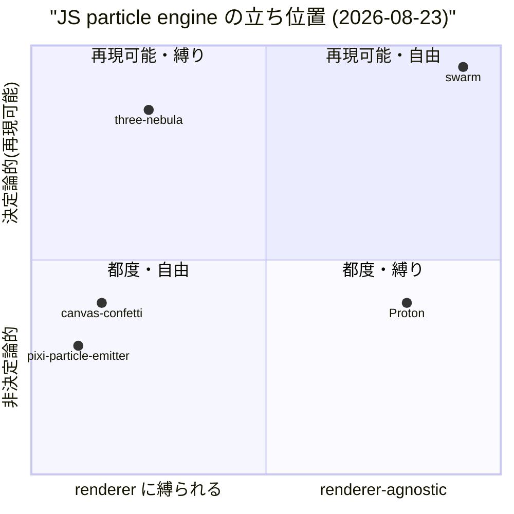
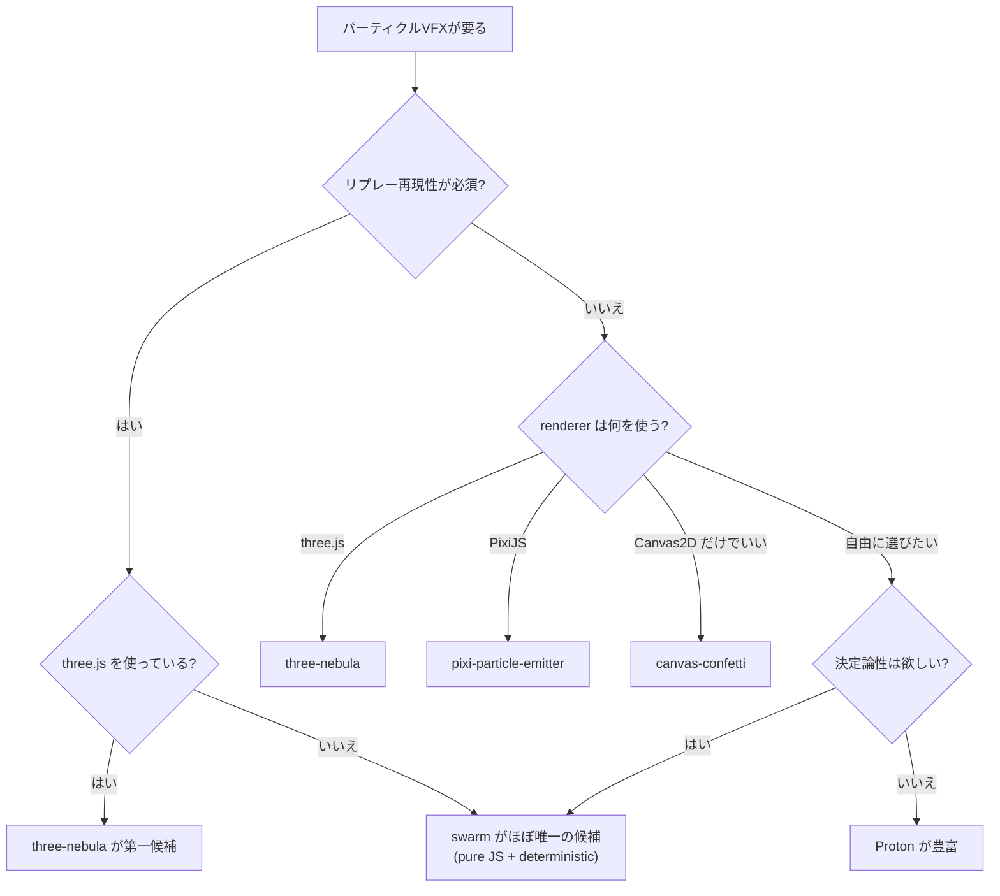

# 0. 要約

swarm は pure JS・依存ゼロ・決定論的・headless なパーティクル/軽量流体エンジンで、**renderer-agnostic な flat buffer を host に渡す**という設計が最大の差別化。比較対象の中で、決定論性を明示的に保証し Node でテストできるのは three-nebula と swarm だけだが、three-nebula は three.js 必須。最大の弱点は M1 の機能範囲が狭いこと（衝突・流体未実装）と、決定論性の価値が「リプレー性のあるゲーム」以外では求心力が弱いこと。次の一手は、M2 SPH-lite を実装して fluid 能力を証明するか、決定論性を活かす具体例（netmahg のリプレー同期）を動くコードで示すこと。

# 1. このrepoは何か

- **一言**: 大量のパーティクルを**安く・決定論的に**動かす VFX エンジン。煙・雪・花びら（drift系）を M1 で持ち、M2 で SPH-lite の水/しぶきを予定する。実体は pure JS のライブラリ。
- **提供価値**: host（ゲーム等）が「renderer に縛られず・リプレーが再現する」パーティクルを数千個スケールで動かすための手間を無くす。three.js や canvas を import しないので、headless な Node で unit test が回る。
- **想定利用者**: リプレー性が要るゲーム開発者（兄弟 repo [netmahg](https://github.com/opaopa6969/netmahg) の季節エフェクト/勝利バーストが driving use case）、および renderer を自前管理したいフロントエンド実装者。
- **到達点の客観指標**（2026-08-23 現地確認）:
  - コア `index.js` 204 行、単一ファイル、**runtime 依存 0**（`package.json` の `dependencies` 空、`files: ["index.js"]`）
  - 公開API: `Field`, `mulberry32` の 2 export（`index.js:27`, `index.js:55`）
  - テスト: `node test.mjs` で **28 passed / 0 failed**（15 ケース、決定論性・flutter・vortex・z軸・3D tornado を含む）
  - 公開URL: CDN（`cdn.jsdelivr.net/gh/opaopa6969/swarm@v0.1.0/index.js`）は README に記載あり、npm 公開は未（`package.json` v0.1.0 だが npm registry 未確認）
  - GitHub: [opaopa6969/swarm](https://github.com/opaopa6969/swarm)、star **0**（参照日 2026-08-23、`gh repo view`）
  - 最終コミット: `8480d36`（CI fix）、開発段階 M1

**比較の単位について**: この repo は**単体で価値を出す**（host が renderer を選ぶだけで完結する）。前段に LLM や人の作業は居ない。よって比較対象は「同じく JS でパーティクル/流体を動かすエンジン・ライブラリ」となる。

# 1.5 調査の型

`target_type: engine`。

生成物（VFX）を作るが**利用者はプログラマ**なので実体はライブラリ。書式の注記に従い「面白さ」ではなく **API 設計**を主軸に比較する:
- 何を引数に取るか（宣言的か命令的か）
- 状態を持つか（決定論性・再現性）
- 拡張点（差し替えられる単位）
- 座標系・単位・時間の扱い
- 最小の "Hello World" が何行か

出力の質については README のサンプル設定（snow/smoke/petals の `Field` オプション）を並べるだけにする。

# 2. 比較対象と選定理由

| 製品 | 何ができるか | 採用状況 | ライセンス | うちとの決定的な違い | なぜ選んだか |
|---|---|---|---|---|---|
| [three-nebula](https://github.com/creativelifeform/three-nebula) | three.js 用 3D パーティクルエンジン。emitter+behaviour+renderer を chain で構成 | ★1.2k / 最終更新 2026-08-22 (v13.0.0) | MIT | **three.js 必須**。決定論性は明示（`setSeed` + 固定回数 update で byte-identical、README に "Determinism & seeding" セクション） | 決定論性+headless test を README に明示する**唯一の**比較対象。swarm の設計思想に最も近い |
| [Proton](https://github.com/drawcall/Proton) | JS パーティクルアニメーションエンジン。Canvas/WebGL/DOM/Pixel/Pixi 等の複数 renderer。CustomRenderer で任意シーンへ | ★2.5k / pushed 2026-03-06、最新 release 2022-04-28 (v5.4.3, npm v7.1.5) | MIT | **runtime 依存ゼロ・renderer-agnostic**（CustomRenderer）。ただし決定論性は README に記述なし、test script 未整備 | renderer-agnostic + pure JS の観点で swarm に最も近い。決定論性の有無が分水嶄 |
| [canvas-confetti](https://github.com/catdad/canvas-confetti) | Canvas2D で confetti/紙吹雪。`confetti(opts)` の命令的 API、Promise ベース | ★12.7k / 最終更新 2025-10-25 (v1.9.4) | ISC | runtime 依存ゼロだが **Canvas2D 専用・Node で動かない**（README に明記）。決定論性不明 | 「pure JS・依存ゼロ・軽量」の代表例。採用数は圧倒的だが用途が狭い（confetti 専門） |
| [pixi-particle-emitter](https://github.com/pixijs-userland/particle-emitter) | PixiJS 用 2D パーティクルエミッタ。JSON config で Emitter を構成 | ★0.85k / pushed 2026-01-09、release v5.0.8 (2022-11) | MIT | **PixiJS 必須**。決定論性不明、test script が `echo done`（テスト未整備） | renderer に縛られるパーティクルライブラリの典型。swarm の「renderer-agnostic」がどれだけ珍しいかの対比 |
| [liquidfun](https://github.com/google/liquidfun) | C++ 2D 物理エンジンにパーティクル/流体機能を持つ。JS port は非公式・inactive | ★4.9k / archived、最終 release 2014 (v1.1.0) | 不明 | C++ 本体で WASM でなく Emscripten バインディングが非公式。**archived** | 「パーティクル/流体」を謳う比較対象として参照。純粋な JS パーティクルエンジンではなく、実質利用不可 |
| [rapier](https://github.com/dimforge/rapier) | Rust 製 2D/3D 剛体物理エンジン。WASM バインディングで JS から利用 | ★5.7k / v0.35.2 (2026-08-15) | Apache-2.0 | **剛体物理メイン・パーティクルシステムは存在しない**。renderer は別 | 「流体/物理」の比較対比として。パーティクルエンジンではないが、SPH-lite 予定の swarm との位置関係を見るために選んだ |

**どういう地図なのか**: JS パーティクルエンジンは寡占でなく**乱立気味**だが、多くは**特定 renderer に縛られる**（three-nebula=three.js、pixi-particle-emitter=PixiJS、canvas-confetti=Canvas2D）。その中で renderer に縛られないのは Proton（CustomRenderer）と swarm くらい。さらに**決定論性を明示する**のは three-nebula だけだが、それは three.js 必須。つまり「pure JS + renderer-agnostic + deterministic + headless-testable」の四つ組を満たすのは**事実上 swarm だけ**という位置にいる。ただし需要が実在する niche かは別問題（5.5節）。

# 3. ポジショニング

````

````

- x軸: renderer に縛られる（左）←→ renderer-agnostic（右）。three.js/PixiJS/Canvas2D 必須を左、pure JS・CustomRenderer を右。
- y軸: 非決定論的（下）←→ 決定論的・再現可能（上）。seeded PRNG + 固定 dt で byte-identical が保証されるか。

swarm は右上の象限に単独でいるが、これは「競合がいない強み」と「需要が薄い可能性」の両刃。

# 4. 機能比較

| 機能 | 重み | swarm (M1) | three-nebula | Proton | canvas-confetti | pixi-particle-emitter |
|---|---|---|---|---|---|---|
| 2D パーティクル drift (煙/雪/花びら) | ◎必須 | ○ | ○(3D含む) | ○ | △(confetti専門) | ○ |
| 3D パーティクル | ○効く | △(z軸+3D tornado) | ○ | △(three.protonで別repo) | × | × |
| 流体/SPH | ○効く | ×(M2予定) | × | × | × | × |
| 衝突 (地面/箱) | ○効く | ×(M3予定) | △ | ○(Collision behaviour) | × | × |
| 決定論的・seeded 再現 | ◎必須 | ○ | ○(明示) | ×(不明) | ×(不明) | ×(不明) |
| headless (Node) でテスト可能 | ◎必須 | ○ | ○ | ×(test未整備) | ×(Node不可) | ×(test未整備) |
| renderer-agnostic (renderer交換可) | ◎必須 | ○ | ×(three.js必須) | ○(CustomRenderer) | ×(Canvas2D) | ×(PixiJS必須) |
| runtime 依存ゼロ | ○効く | ○ | ×(three.js peer) | ○ | ○ | ×(PixiJS peer) |
| 命令的 API (関数呼び出し) | △あれば | ○(field.step) | △(chain/JSON) | △(chain) | ○(confetti(opts)) | △(JSON config) |
| 宣言的 API (data渡し) | △あれば | △(opts辞書) | ○(JSONから構築可) | ○(JSON config) | △ | ○(JSON config) |
| 拡張点 (独自 force/behaviour 追加) | ○効く | △(Field内にhardcoded) | ○(behaviour追加) | ○(behaviour追加) | × | △ |
| パーティクル数スケール (数千) | ○効く | ○(capacity 8192) | ○ | ○(README宣伝) | △(数百〜数千) | ○ |

凡例: ○=ある / △=部分的・要設定 / ×=無い ／ 重み: ◎=この立ち位置で必須 / ○=効く / △=あれば良い / —=不要

**×のうち痛いもの**: 衝突（M3予定）と SPH（M2予定）はまだ無いが、これらは**予定機能**なので「永久に無い」わけではない。痛いのは**拡張点の薄さ**（`△`）で、force が `Field` 内に hardcoded されているため、利用者が独自挙動を差し込みにくい。three-nebula/Proton は behaviour を追加する API が明確で、これがライブラリとしての使い勝手に効く。

**○のうち実は差別化になっていないもの**: 「runtime 依存ゼロ」は canvas-confetti も Proton も持つので、これ単独では差別化にならない。差別化は「依存ゼロ **かつ** renderer-agnostic **かつ** 決定論的」の**組合せ**にある。

# 4.5 コード・実装の比較

| 観点 | swarm | three-nebula | Proton | 出典 |
|---|---|---|---|---|
| 公開API数（export） | 2 (`Field`, `mulberry32`) | 多数（`System` + behaviour/initializer/renderer/zone を `export *`） | 50+（Proton, Emitter, Rate, Span, 各 Behaviour/Renderer/Zone…） | 各 repo の `src/index` |
| コアファイル行数 | 204 行（`index.js` 単一） | 144 ファイル（`src/` 再帰） | 77 ファイル（`src/` 再帰） | `gh api git/trees` で確認 |
| テスト | 28 pass / 0 fail（`node test.mjs`、15 ケース） | 70 ファイル（`test/`、vitest） | なし（`test` dir 無、`example/.../testDestroy.html` のみ） | 実行 / `gh api` で確認 |
| 配布サイズ | `files: ["index.js"]` のみ（単一ファイル） | dist に cjs/mjs/umd/types を生成（vite build） | `build/proton.min.js`（rollup） | 各 `package.json` |
| ライセンスの制約 | MIT | MIT | MIT | 各 LICENSE |
| 依存パッケージ数 (runtime) | 0 | 0（three は peerDep） | 0 | 各 `package.json` |
| 決定論性の実装 | mulberry32 PRNG + sin-based wind + 固定 dt（`index.js:27,40`） | `setSeed` + 固定回数 update（README "Determinism & seeding"） | なし（README に記述なし） | README/コード |

**実装方針の違い**: swarm は **minimal primitives × combinatorial expressiveness**（DESIGN.md）を掲げ、少数の primitive で覆盖する。three-nebula/Proton は**ビヘイビアの種類を増やす**（Alpha, Scale, Color, Attraction, Repulsion, Collision…）方向で拡張性を担保する。前者は「核が小さいほど組み合わせで広がる」、後者は「必要な挙動が既に用意されている」前提。どちらが良いかは利用者が「自分で組み立てる」か「既成品を拾う」かによる。

**Hello World の行数**: swarm は README の snow 例が 3 行（`new Field` + `emit` + `step` のループ）。three-nebula は README の例が約 25 行（System + Renderer + Emitter + Rate + Span + 複数 initializer/behaviour の chain）。Proton は README が約 12 行。swarm は**最小の手間で drift が動く**が、その分挙動の種類が少ない。

# 5.5 調査者の見立て

**何が本当の勝負所か**: 機能比較表では○×が並ぶが、選択を左右するのは実は**「決定論性が必要かどうか」一点**だと思う。決定論性が不要なら Proton（renderer 多様・実績 2.5k star）か three-nebula（three.js 圏なら）で足り、swarm を選ぶ理由は薄い。逆に決定論性が要る（リプレーが一致しなければならないゲーム・テスト自動化）なら、**three.js に縛られない** swarm は代替が事実上無い。つまり勝負所は「決定論性を必要とする需要をどれだけ取り込めるか」で、機能の多さではない。

**数字に出ていないが気になること**: (1) swarm の star が **0** で npm 公開も未確認（CDN 経由のみ）。「比較対象は 0.85k〜12.7k star」の中で、発見可能性がほぼゼロに近く、どれだけ良く作っても使われないリスクが高い。(2) three-nebula が 2026-08-22 に v13 を出していて活発で、同じ「決定論的・headless」を README に明示している点で、swarm の差別化が**three.js を使う人には消える**。(3) Proton は test が未整備で決定論性も不明だが、ユーザが「決定論性なんて要る？」と考えたとき、test が無くても動くものは動くので、実用上は Proton で十分という判断が立ちうる。

**自分ならどうするか**: swarm の立場なら、**決定論性の価値を動くコードで証明する**ことを最優先にする。具体的には netmahg のリプレー（同じ対局 → 同じパーティクル）を 1 つのデモとして動かし、「これが swarm でしか出来ないこと」を示す。機能追加（M2/M3）より先に、**差別化が効く具体例**を 1 つ作る。機能表で埋められない○を増やすより、1 つの「これが swarm でしか無理」を際立たせる方が、star 0 の現状では採用確率が変わると思う。

**この見立てが外れるとしたら**: (a) three-nebula が「three.js に依存しない renderer-agnostic 版」を出したら、swarm の最大差別化は消える。(b) 「決定論的なパーティクル」需要自体が薄く、リプレー性を気にするゲームが GPU shader でパーティクルを処理する（CPU パーティクルをそもそも使わない）なら、swarm の niche が消える。(c) Proton が seeded PRNG と headless test を追加したら、pure JS + renderer-agnostic + deterministic の四つ組で swarm は並ばれ、残る差は「コアが小さい」だけになる（それは好みの問題で、選択理由として弱い）。(a) が最も現実的で、three-nebula は活発なので要注意。

# 6. 提案

| 順 | 提案 | 分類 | 根拠 | 最小の一手 | 効きそうな指標 |
|---|---|---|---|---|---|
| 1 | netmahg で「同じ対局 → 同じパーティクル」のリプレーデモを動かす | 伸ばす | 決定論性（swarm 唯一の○）を具体例で証明。5.5節の見立て | netmahg の一場面に swarm を組み込み、録画を README に置く | デモの有無・外部からの star/jissue |
| 2 | M2 SPH-lite を最小実装で出す | 伸ばす | 4節で fluid が×。比較対象も全滅なので**先抜けで唯一性が増す** | uniform-grid neighbor hash + density→pressure の最小パスを `index.js` に追加 | fluid が動くか（テスト追加） |
| 3 | npm 公開 + README に badge/動く GIF | 埋める | star 0・npm 未確認（5.5節）。発見可能性が比較対象より桁違いに低い | `npm publish` + README に1枚 GIF | npm DL 数・star |
| 4 | 拡張点を明示する（独自 force を差し込める hook） | 埋める | 4節で△。three-nebula/Proton は behaviour 追加 API が明確 | `step` に `forces?: (p,v,k)=>[ax,ay]` の配列を渡せるようにする | 利用者の fork/PR で独自 force が増えるか |
| 5 | **「behaviour を多数追加する」をやらない** | やらない | Alpha/Scale/Color/Attraction…を Proton/three-nebula 並びに揃えること | — | — |

**やらない理由**: behaviour 種類の網羅は、比較対象（Proton 2.5k star, three-nebula 1.2k star）が既に持っており、swarm が後追けで揃えても「Star の差」は埋まらず、**minimal という立ち位置を薄める**だけ。DESIGN.md が「minimal primitives × combinatorial expressiveness」と掲げる以上、種類を増やす方向は思想に反する。拡張は「独自 force を差し込める hook（案4）」で止め、既成品を増やさない方が差別化が保たれる。

# 7. 選択の分岐

````

````

自分を選ばない条件: 「リプレー再現性が不要」かつ「renderer を自由に選びたい」なら Proton で十分。swarm が選ばれるのは**リプレーが要るゲーム**のかなり狭い角。

# 8. 出典

| URL | 参照日 | 何の根拠に使ったか |
|---|---|---|
| `index.js`（自repo、commit 8480d36） | 2026-08-23 | 公開API数(2)、行数(204)、決定論性実装(mulberry32+sin wind)、Field API 仕様 |
| `test.mjs`（自repo） | 2026-08-23 | テスト 28 pass / 0 fail（`node test.mjs` 実行）、15 ケース内容 |
| `package.json`（自repo） | 2026-08-23 | runtime 依存 0、`files: ["index.js"]`、v0.1.0、MIT、npm 公開未確認 |
| `DESIGN.md`（自repo） | 2026-08-23 | 二 regime 設計、M1-M4 ロードマップ、minimal primitives 方針 |
| `gh repo view opaopa6969/swarm` | 2026-08-23 | star 0、MIT、description |
| https://github.com/creativelifeform/three-nebula | 2026-08-22 | ★1.2k、MIT、three.js peerDep、README "Determinism & seeding" セクション、v13.0.0 |
| `gh api repos/creativelifeform/three-nebula/contents/package.json` | 2026-08-22 | peerDependencies (three >=0.122.0 <1.0.0)、test: vitest、src 144ファイル/test 70ファイル |
| https://github.com/drawcall/Proton | 2026-08-22 | ★2.5k、MIT、pushed 2026-03-06、最新 release 2022-04-28、renderer 種類（CustomRenderer 含む） |
| `gh api repos/drawcall/Proton/git/trees/master?recursive=1` | 2026-08-22 | src 77ファイル、test dir 無し（`example/.../testDestroy.html` のみ）、src/index.js で 50+ export |
| https://github.com/catdad/canvas-confetti | 2026-08-22 | ★12.7k、ISC、v1.9.4 (2025-10-25)、runtime 依存 0、README "will not run in Node" 明記 |
| https://github.com/pixijs-userland/particle-emitter | 2026-08-22 | ★0.85k、MIT、PixiJS peerDep、test script `echo done`（未整備） |
| https://github.com/google/liquidfun | 2026-08-22 | ★4.9k、archived、最終 release 2014、C++ 本体（JS port は非公式 inactive）、license 不明 |
| https://github.com/dimforge/rapier | 2026-08-22 | ★5.7k、Apache-2.0、v0.35.2 (2026-08-15)、Rust+WASM、剛体物理（パーティクル機能なし） |

# 9. 備考

初回調査のため「前回からの差分」は無し。
